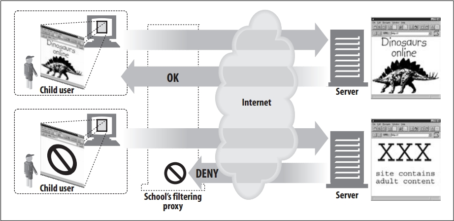

#### 儿童浏览代理

学校为了保证儿童访问的内容健康，对一些网页进行过滤。

#### 访问控制代理

例如一些机构可以针对不同的文档对不同的人设置不同的访问权限，可以大大简化管理难度。

#### 防火墙

可以在应用层级别进行保护，例如可以检测某个网页中含有病毒连接等。

#### Web缓存

将一些经常访问的资源缓存到本地，这样客户端再次请求时即可返回缓存内容，只有内容没有过期，即没必要向Server请求资源。